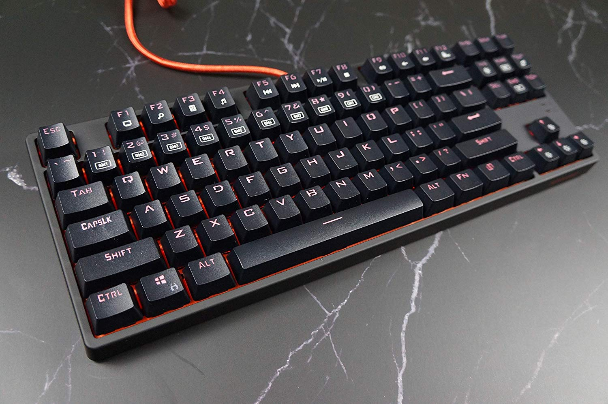

So.

I just got a new keyboard and I really like it so I want to write a post to just enjoy the typing experience.

The actual keyboard isn't very complicated and you should check out [r/mechanicalkeyboards](https://www.reddit.com/r/mechanicalkeyboards) if you want to see some real works of art. No, this is something called a [Doomhammer Choc87](https://www.amazon.com/Doomhammer-Choc-87-Mechanical-Keyboard/dp/B07PBYQ56Z), a cheap Chinese keyboard that has Brown switches. After typing on blues for two years, I was tired of their noise and wanted something with tactile feedback that was also quiet. After optimizing for tactility, cost, and quietness, I settled for Brown switches.

And I've got to say, this is a very nice typing experience. The board is rock solid and sounds great while typing. Gone are the sharp clicks of Blues replaced by the mellow, deep thuds of Browns.

For the key nerds out there, it comes with Outemu box brown switches.

I messed around with settings and I finally understand how to use the function keys. There is a way I can choose which keys to light up for custom lighting profiles which seems like a cool feature and I'll see if it's actually useful.

The cable is braided and while it's an annoying bright orange, it feels good and is long enough to reach behind my keyboard. I can't complain for the price.

My biggest complaint is how hard it is to remove the plastic cover on top and around the board. I tried looking for a disassembly video online but the keyboard isn't popular enough to have a video. I'll eventually work up the courage to pry the cover off, but I'm too afraid of breaking it to try right now.

**In summary**: If you are looking for a solid and quiet mechanical keyboard for an excellent price, consider the Doomhammer Choc 87.
