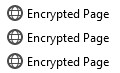

I host this website on github pages which means I don't have access to a server or database. In other words, my website is hosted on computers I don't own and is accessible by anyone.

And I want a login service.

Specifically I want a place where I can type in a password and gain access to private information. However, because my site is public, I have to be able to do this from any computer.

While I have been thinking about this problem for quite a while, it wasn't until I finished taking a cryptography class at college that I learned the tools to do this job. Specifically, AES.

AES is a secure encryption algorithm where you take your data and encrypt it with a key. When you want your data back, you use the key again to decrypt. As far as I know AES has a long enough key that it hasn't been cracked and it probably won't be cracked any time soon.

From a high level, I used AES to encrypt and decrypt the contents of my secret web pages with a password.

Before encryption, my secret website looks like:
```
main.html
other.html
```

When my website is encrypted, the file structure looks as follows:
```
007a69b693fbc1f43f7ce8f4c9779621.html
222e1238c95503abd14586130ee685c1.html
aes.js
landing.html
sha256.js
```

The html files with hex names correspond to `main.html` and `other.html`, and the additional files are libraries to help decrypt the pages.

I make sure to obfuscate the real file names to make it harder for people to get any information from even the file structure.

`aes.js` and `sha256.js` are encryption libraries I found online and `landing.html` is the webpage through which you access the private site.

My claim is that it is very hard to decode the webpages without the password.

For example, this is what `007a69b693fbc1f43f7ce8f4c9779621.html` looks like:
```html
<!DOCTYPE html>
<html>
<head>
  <meta charset="UTF-8">
  <title>Encrypted Page</title>
  <script type="text/javascript" src="aes.js"></script>
</head>
<body>
  <script type="text/javascript">
    const page = '9e030b9d0dddf39ba44fb1a82ab0c5181efd3dca33ea8e452646daef8522542bc08fc655c66c08f227db29fc3f632db4371a2a1b3971b65eaaf360459628be2d7cd19170faf5729422ac826d101f237a7ad418617efb6630c812b014f687e500f3a24d0944224351a9333dbc34bb3a8a5cad54eb82b0eeb498accadf3cbba5b644725b46a72b5ef1deb9e4125b7e03e80d72fd44383f81445fb49c013d321104091a841c593c30b640868337746db26e779196ce0a7a5d277cf48c4e504a7ad0a78f6806340549924f0336fc192a86f4282e43044b9d5c0e23cd8b1e847676a3fcfcb988d6039c43be92fb18ed64f595d3680b324c298892833dd82d6042bf630534a9';
    window.onload = () => {
      const url = window.location.href;
      const match = url.match(/\?key=(.*)$/);
      console.assert(match !== null);
      const hexKey = match[1];
      console.assert(hexKey.length == 32);
      const byteKey = aesjs.utils.hex.toBytes(hexKey);
      const aes = new aesjs.ModeOfOperation.ctr(byteKey, new aesjs.Counter(1));
      const pageBytes = aesjs.utils.hex.toBytes(page);
      const decryptedBytes = aes.decrypt(pageBytes);
      const decryptedPage = aesjs.utils.utf8.fromBytes(decryptedBytes);
      document.body.innerHTML = decryptedPage;
    }
  </script>
</body>
</html>
```

It's pretty hard to tell that hex string decrypts into the following page.

```html
<html><head>
  <meta charset="UTF-8">
  <title>Encrypted Page</title>
  <script type="text/javascript" src="aes.js"></script>
</head>
<body><h1>Main Page</h1>
<p>Welcome to the ecnrypted page!</p>
<p>You are here because you managed to type in the correct password.</p>
<p>Here's a link to the <a href="222e1238c95503abd14586130ee685c1.html?key=d74ff0ee8da3b9806b18c877dbf29bbd">other page</a>.</p>
</body></html>
```

When the page loads, it uses the key from the url to decrypt the page contents and sets the decrypted message as the body's innerHTML. From the user's perspective, the decryption happens instantly.

# The Landing Page

`landing.html` is very similar except it only stores the encrypted url of the first secret page.

To get the first link, the landing page:
1. gets the first 128 bits of the sha256 of the password and a random salt.
2. uses those bits as an AES key to decrypt the link.
3. goes to the link and passes the AES key through the url.

```html
<!DOCTYPE html>
<html>
<head>
  <meta charset="UTF-8">
  <title>Encrypted Page</title>
  <script type="text/javascript" src="aes.js"></script>
  <script type="text/javascript" src="sha256.js"></script>
</head>
<body>
  <script type="text/javascript">
    const link = 'a2115315d3475b01bb63383b86fb7c51';
    window.onload = () => {
      const input = document.getElementsByTagName('input')[0];
      input.addEventListener('keydown', event => {
        if (event.key === 'Enter') {
          const pass = event.target.value;
          const m = sha256.create();
          m.update(pass);
          const hexPass = m.hex().substr(0,32);

          const byteKey = aesjs.utils.hex.toBytes(hexPass);
          const aes = new aesjs.ModeOfOperation.ctr(byteKey, new aesjs.Counter(1));
          const linkBytes = aesjs.utils.hex.toBytes(link);
          const decryptedLink = aesjs.utils.hex.fromBytes(aes.decrypt(linkBytes));
          const url = `${decryptedLink}.html?key=${hexPass}`;
          window.location.href = url;
        }
      });
    }
  </script>
  <input type="password">
</body>
</html>
```

Go to [the landing page](/secret/landing) to try it out. The password is `pass`.

# Restrictions and Future Ideas

The main restriction of this setup is it only works for one user. I'm sure there are algorithms that support multiple passwords but at that point it would make sense to switch to a dedicated password service.

Another small shortcoming is the title of secret pages always says "Encrypted Page". I could fix this by encrypting the page title along with page contents and it would probably be more secure to encrypt them together. Maybe json would be a good encoding format. On the other hand, it is kinda cool that the page appears as "Encrypted Page" in my browser history.

Speaking of browser history, because the key is passed through the url, anyone can access my secret site by looking at my history. It also means I can bookmark a page and never need to type in the password again.



Now that I have an AES-secured secret site, I'm not sure what to do with it. Maybe I'll host some e-books I'm reading, or posts I'm working on, or a journal, or a todo list.

But whatever it is, I hope it's secure.
